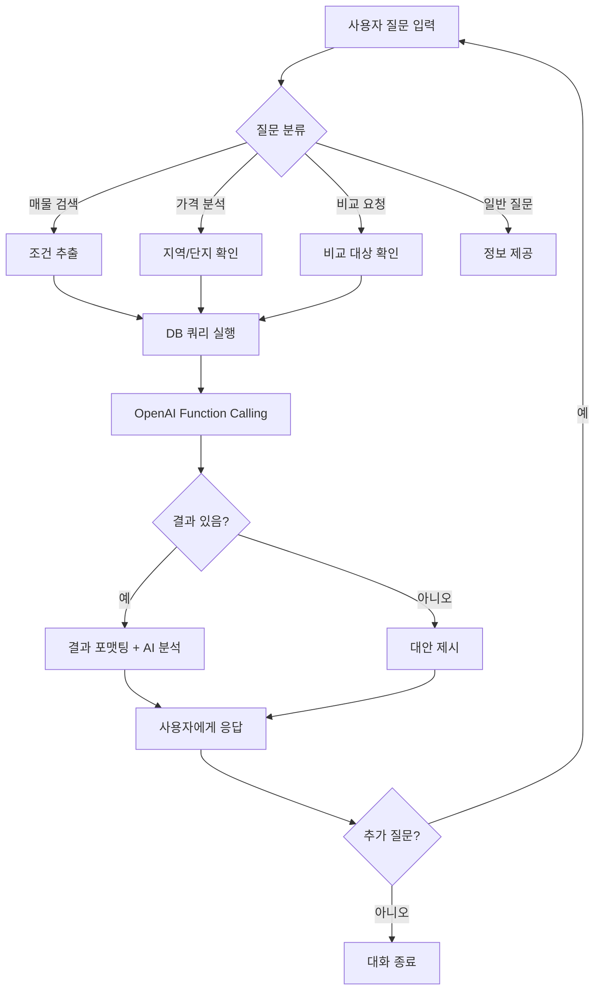

# 네이버 부동산 AI 에이전트 제안서

## 📌 프로젝트 개요

**프로젝트명**: Estate-Hub AI Agent
**목적**: 네이버 부동산 데이터 기반 AI 대화형 부동산 검색 및 분석 서비스
**타겟 사용자**: 부동산 매물을 찾는 일반 사용자, 부동산 시장 분석이 필요한 투자자
**핵심 가치**: 복잡한 부동산 정보를 자연어 대화로 쉽게 검색하고 분석

---

## 🎯 에이전트 핵심 기능

### 1. 자연어 기반 매물 검색
- **기능**: 사용자가 일상 언어로 조건을 말하면 적절한 매물 검색
- **예시**:
  - "강남구에서 30평대 아파트 찾아줘"
  - "역삼동 전세 5억 이하로 보여줘"
  - "학군 좋은 곳에서 신축 아파트 추천해줘"

### 2. 가격 분석 및 시세 비교
- **기능**: 지역별, 단지별, 평형별 가격 통계 제공
- **예시**:
  - "개포동 래미안 평균 시세 알려줘"
  - "강남구와 송파구 30평 전세가 비교해줘"
  - "이 아파트 작년 대비 얼마나 올랐어?"

### 3. 단지 비교 및 추천
- **기능**: 여러 아파트 단지를 조건별로 비교하고 추천
- **예시**:
  - "래미안 vs 아크로 비교해줘"
  - "출퇴근 편한 곳 추천해줘"
  - "신혼부부한테 좋은 아파트 찾아줘"

### 4. 매물 알림 및 모니터링
- **기능**: 관심 지역/단지의 가격 변동 추적 (Phase 2)
- **예시**:
  - "이 단지 가격 떨어지면 알려줘"
  - "신규 매물 나오면 알림 받고 싶어"

### 5. 시장 인사이트 제공
- **기능**: AI가 데이터 기반 트렌드 분석 및 인사이트 제공
- **예시**:
  - "요즘 강남 시장 어때?"
  - "전세 수요 많은 지역 어디야?"

---

## 👥 사용자 시나리오

### 시나리오 1: 신혼부부 김철수 (30대)
**목표**: 서울 강남권에서 첫 집 마련

```
사용자: 안녕! 강남구에서 전세 구하려고 하는데 도와줄래?

에이전트: 안녕하세요! 강남구 전세 매물을 찾아드리겠습니다.
몇 가지 질문드릴게요:
1. 희망하시는 전세 보증금 범위가 어떻게 되시나요?
2. 선호하시는 평형대가 있으신가요?
3. 특별히 원하시는 동네나 조건이 있나요?

사용자: 전세 5억 이하, 20평대면 좋겠어. 역 가까운 곳으로!

에이전트: 알겠습니다! 강남구에서 전세 5억 이하,
20평대 매물을 검색해드릴게요.

[검색 실행]

찾았습니다! 조건에 맞는 아파트 12개를 찾았어요:

**TOP 3 추천**
1. 📍 **대치동 은마아파트** 23평
   - 전세: 4.5억원
   - 3호선 대치역 도보 5분
   - 입주: 1979년 (리모델링 완료)

2. 📍 **개포동 개포주공1단지** 24평
   - 전세: 4.8억원
   - 3호선 경찰병원역 도보 7분
   - 재건축 예정 단지

3. 📍 **삼성동 삼성래미안** 25평
   - 전세: 4.9억원
   - 2호선 삼성역 도보 10분
   - 입주: 2003년

더 자세한 정보를 원하시는 단지가 있으신가요?

사용자: 개포주공이랑 삼성래미안 비교해줘

에이전트: 두 단지를 비교해드릴게요.

| 항목 | 개포주공1단지 | 삼성래미안 |
|------|--------------|-----------|
| 전세가 | 4.8억 | 4.9억 |
| 역세권 | 경찰병원역 7분 | 삼성역 10분 |
| 입주년도 | 1979년 | 2003년 |
| 총세대수 | 1,544세대 | 1,200세대 |
| 특이사항 | 재건축 기대감 | 학군 우수 |

**AI 분석**:
- 개포주공: 재건축 진행 중이라 가격 상승 가능성 있음.
  단, 오래된 건물이라 주거 환경은 다소 열악할 수 있어요.
- 삼성래미안: 비교적 신축이고 학군이 좋아 안정적.
  장기 거주 계획이라면 추천드립니다.

어떤 단지가 더 마음에 드시나요?
```

---

### 시나리오 2: 부동산 투자자 박영희 (40대)
**목표**: 투자 가치 높은 매물 분석

```
사용자: 송파구에서 투자하기 좋은 아파트 찾아줘

에이전트: 송파구 투자용 아파트를 찾아드릴게요.
투자 목적에 따라 추천이 달라질 수 있는데요:
1. 단기 시세차익
2. 장기 임대수익
3. 재건축 기대

어떤 목적이신가요?

사용자: 재건축 기대하는 곳!

에이전트: 송파구 재건축 유망 단지를 분석해드릴게요.

[분석 실행]

**재건축 유망 단지 TOP 3**

1. 📈 **가락동 가락시영아파트**
   - 현재 시세: 9.8억 (25평 기준)
   - 입주: 1983년 (42년 경과) ✅
   - 용적률: 178% → 재건축시 350% 예상
   - 재건축 추진 단계: 안전진단 통과 ✅
   - **투자 포인트**: 조합 설립 완료, 2026년 착공 예상

2. 📈 **잠실동 잠실주공5단지**
   - 현재 시세: 12.5억 (28평 기준)
   - 입주: 1978년 (47년 경과) ✅
   - 재건축 단계: 정비구역 지정
   - **투자 포인트**: 잠실 핵심지, 프리미엄 예상

3. 📈 **방이동 올림픽선수촌아파트**
   - 현재 시세: 10.2억 (26평 기준)
   - 입주: 1988년 (37년 경과)
   - 재건축 단계: 조합 설립 승인
   - **투자 포인트**: 역세권, 브랜드 가치 상승 기대

**AI 투자 분석**:
가락시영이 현재 시점에서 가장 유망해 보입니다.
- ✅ 안전진단 통과로 사업 불확실성 낮음
- ✅ 시세가 상대적으로 저렴해 진입 장벽 낮음
- ⚠️ 단, 조합원 분담금 발생 가능성 고려 필요

더 자세한 분석이 필요하신가요?
```

---

## 🔄 대화 플로우 설계

### 기본 대화 흐름



### 멀티턴 대화 예시

```
Turn 1:
👤 "강남구 아파트 찾아줘"
🤖 [검색 조건 부족 → 추가 정보 요청]
   "강남구 매물을 찾아드리겠습니다.
    매매/전세/월세 중 어떤 걸 찾으시나요?"

Turn 2:
👤 "전세"
🤖 [조건 저장, 추가 질문]
   "전세 매물이시군요. 희망 보증금과 평형대를 알려주시겠어요?"

Turn 3:
👤 "5억 이하, 30평대"
🤖 [검색 실행 + 결과 제공]
   "강남구 전세 5억 이하, 30평대 매물 8개를 찾았습니다..."

Turn 4:
👤 "이 중에 역세권만 보여줘"
🤖 [필터 추가 적용]
   "역세권 매물로 필터링하면 4개가 남습니다..."
```

---

## 🛠️ Function/Tool 설계

### OpenAI Function Calling Tools

#### 1. `search_apartments`
**용도**: 조건별 아파트 검색

```json
{
  "name": "search_apartments",
  "description": "지역, 가격, 면적 등의 조건으로 아파트 매물을 검색합니다.",
  "parameters": {
    "type": "object",
    "properties": {
      "region": {
        "type": "string",
        "description": "시/군/구 또는 읍/면/동 (예: 강남구, 역삼동)"
      },
      "transaction_type": {
        "type": "string",
        "enum": ["매매", "전세", "월세"],
        "description": "거래 유형"
      },
      "min_price": {
        "type": "number",
        "description": "최소 가격 (만원 단위)"
      },
      "max_price": {
        "type": "number",
        "description": "최대 가격 (만원 단위)"
      },
      "min_area": {
        "type": "number",
        "description": "최소 전용면적 (㎡)"
      },
      "max_area": {
        "type": "number",
        "description": "최대 전용면적 (㎡)"
      },
      "min_year": {
        "type": "number",
        "description": "최소 입주년도 (예: 2000)"
      },
      "limit": {
        "type": "number",
        "description": "최대 결과 개수 (기본 10개)"
      }
    },
    "required": ["region"]
  }
}
```

#### 2. `get_price_statistics`
**용도**: 가격 통계 및 시세 분석

```json
{
  "name": "get_price_statistics",
  "description": "특정 지역이나 단지의 가격 통계를 제공합니다.",
  "parameters": {
    "type": "object",
    "properties": {
      "region": {
        "type": "string",
        "description": "분석할 지역 (예: 강남구)"
      },
      "complex_name": {
        "type": "string",
        "description": "아파트 단지명 (선택사항)"
      },
      "pyeong": {
        "type": "string",
        "description": "평형 (예: 30평)"
      },
      "transaction_type": {
        "type": "string",
        "enum": ["매매", "전세", "월세"]
      }
    },
    "required": ["region", "transaction_type"]
  }
}
```

#### 3. `compare_complexes`
**용도**: 여러 아파트 단지 비교

```json
{
  "name": "compare_complexes",
  "description": "여러 아파트 단지를 비교 분석합니다.",
  "parameters": {
    "type": "object",
    "properties": {
      "complex_names": {
        "type": "array",
        "items": {
          "type": "string"
        },
        "description": "비교할 아파트 단지명 배열 (2~4개)"
      },
      "comparison_criteria": {
        "type": "array",
        "items": {
          "type": "string",
          "enum": ["가격", "입주년도", "세대수", "교통", "학군"]
        },
        "description": "비교 기준"
      }
    },
    "required": ["complex_names"]
  }
}
```

#### 4. `get_complex_details`
**용도**: 특정 아파트 단지 상세 정보

```json
{
  "name": "get_complex_details",
  "description": "특정 아파트 단지의 상세 정보를 조회합니다.",
  "parameters": {
    "type": "object",
    "properties": {
      "complex_id": {
        "type": "string",
        "description": "단지 ID (네이버 부동산 코드)"
      },
      "include_price_history": {
        "type": "boolean",
        "description": "가격 변동 이력 포함 여부"
      }
    },
    "required": ["complex_id"]
  }
}
```

#### 5. `analyze_investment`
**용도**: 투자 가치 분석 (Phase 2)

```json
{
  "name": "analyze_investment",
  "description": "재건축, 리모델링 등 투자 관점에서 단지를 분석합니다.",
  "parameters": {
    "type": "object",
    "properties": {
      "region": {
        "type": "string",
        "description": "분석할 지역"
      },
      "investment_type": {
        "type": "string",
        "enum": ["재건축", "리모델링", "임대수익", "시세차익"],
        "description": "투자 유형"
      }
    },
    "required": ["region", "investment_type"]
  }
}
```

---

## 💾 데이터 모델 설계

### Supabase 테이블 스키마

#### 1. `complexes` (아파트 단지)
```sql
CREATE TABLE complexes (
  id BIGSERIAL PRIMARY KEY,
  complex_code VARCHAR(50) UNIQUE NOT NULL,  -- 네이버 단지 코드
  name VARCHAR(200) NOT NULL,                -- 단지명
  address TEXT NOT NULL,                     -- 주소
  sido VARCHAR(50),                          -- 시/도
  gungu VARCHAR(50),                         -- 시/군/구
  dong VARCHAR(50),                          -- 읍/면/동
  total_households INTEGER,                  -- 총 세대수
  move_in_year INTEGER,                      -- 입주년도
  move_in_month INTEGER,                     -- 입주월
  latitude DECIMAL(10, 8),                   -- 위도
  longitude DECIMAL(11, 8),                  -- 경도
  created_at TIMESTAMP DEFAULT NOW(),
  updated_at TIMESTAMP DEFAULT NOW()
);

CREATE INDEX idx_complexes_region ON complexes(sido, gungu, dong);
CREATE INDEX idx_complexes_name ON complexes(name);
```

#### 2. `unit_types` (평형 정보)
```sql
CREATE TABLE unit_types (
  id BIGSERIAL PRIMARY KEY,
  complex_id BIGINT REFERENCES complexes(id) ON DELETE CASCADE,
  pyeong VARCHAR(20),                        -- 평형 (예: "30평")
  supply_area DECIMAL(6, 2),                 -- 공급면적 (㎡)
  exclusive_area DECIMAL(6, 2),              -- 전용면적 (㎡)
  created_at TIMESTAMP DEFAULT NOW()
);

CREATE INDEX idx_unit_types_complex ON unit_types(complex_id);
CREATE INDEX idx_unit_types_area ON unit_types(exclusive_area);
```

#### 3. `prices` (가격 정보)
```sql
CREATE TABLE prices (
  id BIGSERIAL PRIMARY KEY,
  complex_id BIGINT REFERENCES complexes(id) ON DELETE CASCADE,
  unit_type_id BIGINT REFERENCES unit_types(id) ON DELETE CASCADE,
  transaction_type VARCHAR(20),              -- 매매/전세/월세
  price_low BIGINT,                          -- 최저가 (만원)
  price_high BIGINT,                         -- 최고가 (만원)
  price_avg BIGINT,                          -- 평균가 (만원)
  monthly_rent BIGINT,                       -- 월세 (만원, 월세인 경우)
  recorded_at DATE,                          -- 기록일
  created_at TIMESTAMP DEFAULT NOW()
);

CREATE INDEX idx_prices_complex ON prices(complex_id);
CREATE INDEX idx_prices_type ON prices(transaction_type);
CREATE INDEX idx_prices_date ON prices(recorded_at);
```

#### 4. `user_preferences` (사용자 선호 - Phase 2)
```sql
CREATE TABLE user_preferences (
  id BIGSERIAL PRIMARY KEY,
  user_id UUID,                              -- 사용자 ID (익명 가능)
  saved_searches JSONB,                      -- 저장된 검색 조건
  favorite_complexes JSONB,                  -- 관심 단지
  alert_settings JSONB,                      -- 알림 설정
  created_at TIMESTAMP DEFAULT NOW(),
  updated_at TIMESTAMP DEFAULT NOW()
);
```

### 데이터 관계도

```
complexes (1) ──< (N) unit_types
    │
    └──< (N) prices

prices (N) ──> (1) unit_types
```

---

## 🎨 UI/UX 설계

### 화면 구성

#### 메인 화면 (와이어프레임)

```
┌─────────────────────────────────────────────────────────┐
│  🏠 Estate-Hub AI                          [설정] [로그인] │
├─────────────────────────────────────────────────────────┤
│                                                          │
│  ┌────────────────────────────────────────────────────┐ │
│  │  💬 채팅 영역                                       │ │
│  │                                                     │ │
│  │  🤖 안녕하세요! 부동산 매물을 찾아드립니다.         │ │
│  │     어떤 집을 찾으시나요?                          │ │
│  │                                                     │ │
│  │  👤 강남구에서 전세 5억 이하 아파트 찾아줘         │ │
│  │                                                     │ │
│  │  🤖 검색 중...                                      │ │
│  │     ┌─────────────────────────────────────┐        │ │
│  │     │ 📊 검색 결과: 12개 매물             │        │ │
│  │     │                                      │        │ │
│  │     │ 1. 대치동 은마아파트 23평           │        │ │
│  │     │    전세 4.5억 | 대치역 5분          │        │ │
│  │     │    [상세보기] [비교함에 추가]       │        │ │
│  │     │                                      │        │ │
│  │     │ 2. 개포동 개포주공1단지 24평        │        │ │
│  │     │    전세 4.8억 | 경찰병원역 7분      │        │ │
│  │     │    [상세보기] [비교함에 추가]       │        │ │
│  │     └─────────────────────────────────────┘        │ │
│  │                                                     │ │
│  └─────────────────────────────────────────────────────┘ │
│                                                          │
│  ┌────────────────────────────────────────────────────┐ │
│  │ 💭 메시지를 입력하세요...            [전송]       │ │
│  └────────────────────────────────────────────────────┘ │
│                                                          │
│  💡 추천 질문:                                           │
│  • 강남구 평균 전세가 알려줘                            │
│  • 재건축 유망한 아파트 찾아줘                          │
│  • 역세권 신축 아파트 추천해줘                          │
└─────────────────────────────────────────────────────────┘
```

#### 사이드바 (옵션)

```
┌──────────────────┐
│  📌 빠른 필터     │
├──────────────────┤
│  지역             │
│  ▢ 서울           │
│  ▢ 경기           │
│                   │
│  거래유형         │
│  ⦿ 전체           │
│  ○ 매매           │
│  ○ 전세           │
│  ○ 월세           │
│                   │
│  가격대           │
│  [5억] ~ [10억]  │
│                   │
│  면적             │
│  [60㎡] ~ [100㎡]│
│                   │
│  [적용하기]       │
├──────────────────┤
│  📋 비교함 (2)    │
│  • 은마아파트    │
│  • 개포주공      │
│  [비교하기]      │
└──────────────────┘
```

### UI 컴포넌트

#### 1. 채팅 메시지 카드
- 사용자 메시지: 오른쪽 정렬, 파란색 배경
- AI 메시지: 왼쪽 정렬, 회색 배경
- 로딩 중: 타이핑 애니메이션 (...)

#### 2. 매물 카드
```
┌─────────────────────────────────────┐
│  📸 [아파트 이미지]                  │
│                                      │
│  📍 대치동 은마아파트               │
│  💰 전세 4억 5천만원                │
│  📐 23평 (전용 76㎡)                │
│  🚇 3호선 대치역 도보 5분           │
│  🏗️ 1979년 입주                    │
│                                      │
│  [상세보기]  [비교함]  [❤️ 관심]     │
└─────────────────────────────────────┘
```

#### 3. 비교 테이블
```
┌──────────────────────────────────────────────────┐
│  단지 비교                                  [닫기] │
├──────────────┬────────────────┬────────────────┤
│              │  은마아파트    │  개포주공1단지 │
├──────────────┼────────────────┼────────────────┤
│  전세가      │  4.5억         │  4.8억         │
│  평형        │  23평          │  24평          │
│  역세권      │  대치역 5분    │  경찰병원 7분  │
│  입주년도    │  1979년        │  1979년        │
│  총세대수    │  1,200         │  1,544         │
└──────────────┴────────────────┴────────────────┘
```

---

## ⚙️ 기술적 고려사항

### 1. 성능 최적화
- **응답 속도**: OpenAI API 호출 최적화 (스트리밍 응답)
- **캐싱**: 자주 조회되는 데이터 Redis 캐싱 (Phase 2)
- **DB 인덱싱**: 검색 성능 향상을 위한 적절한 인덱스
- **페이지네이션**: 대량 결과 처리

### 2. 보안
- **API 키 보호**:
  - Frontend에서 OpenAI API 직접 호출 금지
  - Vercel/Netlify Functions를 프록시로 사용
  - 환경변수로 키 관리
- **Rate Limiting**: API 남용 방지
- **CORS**: 적절한 CORS 정책 설정
- **Row Level Security**: Supabase RLS 활용

### 3. 에러 핸들링
- **네트워크 에러**: 재시도 로직
- **API 한도 초과**: 사용자 친화적 메시지
- **검색 결과 없음**: 대안 제시
- **잘못된 입력**: 유효성 검사 및 가이드

### 4. 사용자 경험
- **로딩 상태**: 스켈레톤 UI, 프로그레스 바
- **에러 피드백**: 명확한 에러 메시지
- **모바일 최적화**: 반응형 디자인
- **다크모드**: 테마 지원 (선택사항)

### 5. AI 프롬프트 전략

#### System Prompt
```
당신은 대한민국 부동산 전문 AI 어시스턴트입니다.

역할:
- 사용자의 주거 니즈를 이해하고 최적의 매물을 추천
- 부동산 시장 데이터를 기반으로 객관적인 분석 제공
- 친근하고 전문적인 톤으로 대화

제약사항:
- 법적 조언이나 투자 권유는 하지 않음
- 데이터에 없는 정보는 추측하지 않음
- 가격 예측은 과거 데이터 기반으로만 제공

응답 형식:
- 간결하고 구조화된 답변
- 필요시 표, 목록 사용
- 이모지 적절히 활용
```

#### Few-Shot Examples
```
사용자: "강남구 아파트 찾아줘"
AI: "강남구 매물을 찾아드리겠습니다. 몇 가지만 여쭤볼게요:
1. 매매/전세/월세 중 어떤 걸 찾으시나요?
2. 희망 가격대가 어떻게 되시나요?
3. 선호하시는 평형대가 있으신가요?"

---

사용자: "이 아파트 가격 비싸?"
AI: "[아파트명]의 현재 시세는 [X]억원입니다.
같은 지역 비슷한 평형 평균 시세가 [Y]억원이니,
평균보다 [Z]% 높은/낮은 편입니다."
```

### 6. 데이터 수집 전략

#### GitHub Actions 스케줄
```yaml
- 매일 새벽 2시: 주요 지역 전체 크롤링
- 매주 일요일: 전국 데이터 업데이트
- 필요시 수동 트리거 가능
```

#### 우선순위 지역
1. 서울 주요 구 (강남, 서초, 송파, 강동 등)
2. 경기 주요 시 (성남, 용인, 수원 등)
3. 점진적 확장

---

## 📊 성공 지표 (KPI)

### Phase 1 목표
- [ ] 검색 응답 속도 < 3초
- [ ] AI 응답 정확도 > 90%
- [ ] 데이터 커버리지: 서울 25개 구
- [ ] 사용자 만족도 > 4.0/5.0

### Phase 2 목표
- [ ] 일간 활성 사용자(DAU) 100명
- [ ] 검색 성공률 > 95%
- [ ] 알림 전환율 > 20%

---

## 🚀 개발 로드맵

### Phase 1: MVP (2주)
**Week 1**
- [ ] Supabase 설정 및 스키마 구축
- [ ] 크롤러 → DB 연동
- [ ] GitHub Actions 자동화
- [ ] 초기 데이터 수집 (서울 주요 5개 구)

**Week 2**
- [ ] React Frontend 기본 UI
- [ ] OpenAI Function Calling 구현
- [ ] 검색 기능 구현
- [ ] GitHub Pages 배포

### Phase 2: 고도화 (2주)
- [ ] 가격 분석 및 통계 기능
- [ ] 단지 비교 기능
- [ ] 가격 변동 이력 추적
- [ ] UI/UX 개선

### Phase 3: 확장 (진행중)
- [ ] 사용자 계정 및 관심 매물 저장
- [ ] 알림 기능
- [ ] 투자 분석 고도화
- [ ] 모바일 앱 (PWA)

---

## 💰 예상 비용

### 무료 티어 활용
- GitHub Pages: 무료
- Supabase: 무료 (500MB DB, 월 500MB 대역폭)
- Vercel Functions: 무료 (100GB-시간/월)
- GitHub Actions: 무료 (2,000분/월)

### 유료 비용
- **OpenAI API**: 사용량 기반
  - GPT-4o: $5/1M input tokens, $15/1M output tokens
  - 예상: 일 100회 대화 → 월 $10~30 예상

### 총 예상 운영비: **월 $10~50**

---

## ❓ 리스크 및 대응 방안

| 리스크 | 영향도 | 대응 방안 |
|--------|--------|-----------|
| 네이버 API 정책 변경 | 높음 | 백업 크롤러 구축, 공식 API 전환 검토 |
| OpenAI API 비용 초과 | 중간 | Rate limiting, 캐싱, 무료 LLM 대안 |
| 데이터 정확도 문제 | 높음 | 주기적 검증, 사용자 피드백 수집 |
| 서버리스 함수 콜드 스타트 | 낮음 | Keep-alive ping, 캐싱 |
| Supabase 무료 용량 초과 | 중간 | 오래된 데이터 아카이빙, 유료 플랜 전환 |

---

## 🎯 결론

Estate-Hub AI Agent는 **서버리스 아키텍처**를 활용하여:
- ✅ 로컬 환경 의존성 제로
- ✅ 자동 배포 및 확장
- ✅ 최소 운영 비용
- ✅ AI 기반 자연어 인터페이스

**단계적 개발**을 통해 안정적으로 기능을 확장하며,
사용자에게 **직관적이고 강력한 부동산 검색 경험**을 제공합니다.

---

**다음 단계**: 이 제안서를 기반으로 구현을 시작하시겠습니까?
