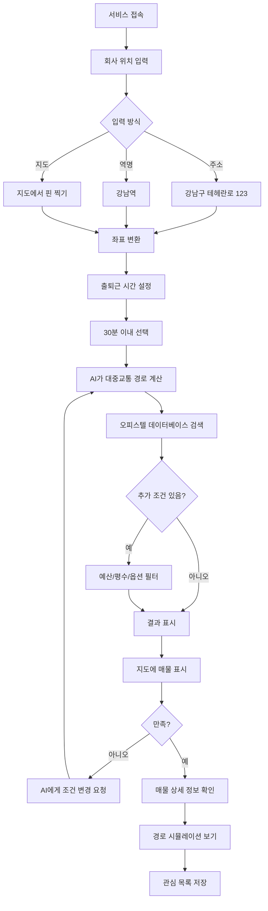

# 출퇴근 기반 오피스텔 추천 AI 에이전트 제안서

## 📌 프로젝트 개요

**프로젝트명**: Estate-Hub Commute Agent (출퇴근 스마트 오피스텔 파인더)
**핵심 아이디어**: 회사 위치를 기준으로 대중교통으로 출퇴근 가능한 오피스텔을 AI가 추천
**타겟 사용자**: 직장인, 신입사원, 이직자, 출퇴근 시간을 줄이고 싶은 모든 사람
**차별화 포인트**: "집 → 회사"가 아닌 "회사 → 집" 역순 검색, 실제 환승 경로 제공

---

## 🎯 핵심 기능

### 1. 회사 위치 기반 검색
**기능**: 사용자가 회사 주소나 역명을 입력하면 지도에서 좌표 추출
- 주소 입력: "서울시 강남구 테헤란로 123"
- 역 입력: "강남역", "정자역"
- 지도 클릭: 직접 핀 찍기

**구현**: 카카오맵 주소 검색 API 또는 좌표 입력

---

### 2. 시간대별 출퇴근 가능 오피스텔 추천
**기능**: 설정한 시간 내 출퇴근 가능한 오피스텔 자동 필터링

**시간 옵션**:
- 🟢 30분 이내 (도보 포함 총 소요시간)
- 🟡 1시간 이내
- 🔴 사용자 지정 (예: 45분)

**예시**:
```
사용자: 정자역이 회사인데 30분 안에 출퇴근 가능한 오피스텔 찾아줘

AI 응답:
30분 이내 출퇴근 가능한 오피스텔 12개를 찾았습니다.

📍 추천 지역:
1. 미금역 일대 (5개 오피스텔)
   - 신분당선 직통 2정거장, 약 8분

2. 강남역 일대 (3개 오피스텔)
   - 신분당선 직통 5정거장, 약 15분

3. 수서역 일대 (4개 오피스텔)
   - 수인분당선 직통 4정거장, 약 18분
```

---

### 3. 상세 경로 정보 제공
**기능**: 단순 시간이 아닌 "어떻게" 가는지 구체적 경로 제공

**예시 1: 지하철 직통**
```
📍 미금역 현대오피스텔 → 정자역
🚇 신분당선 (2정거장, 8분)
💰 요금: 1,400원
```

**예시 2: 환승 1회**
```
📍 군자역 SK허브 오피스텔 → 정자역
🚇 7호선 (군자역 → 강남구청역, 15분)
  ↓ 환승 (도보 3분)
🚇 신분당선 (강남구청역 → 정자역, 20분)
💰 요금: 1,550원
⏱️ 총 소요시간: 38분
```

**예시 3: 버스 + 지하철**
```
📍 문정역 래미안 오피스텔 → 정자역
🚌 102번 버스 (문정역 → 강남역, 25분)
  ↓ 하차 후 도보 5분
🚇 신분당선 (강남역 → 정자역, 12분)
💰 요금: 2,300원 (환승 할인 적용)
⏱️ 총 소요시간: 42분
```

---

### 4. 오피스텔 단지 그룹화 및 필터링
**기능**: 역 중심으로 오피스텔을 자동 그룹화

**그룹화 기준**:
- 같은 역 도보 5분 이내 → 하나의 그룹
- 예: "강남역 오피스텔존" (15개 오피스텔)

**필터 옵션**:
- 가격대: 보증금 5,000만원 이하, 월세 50만원 이하 등
- 평수: 원룸, 투룸, 15평 이상 등
- 건물 옵션: 신축 (5년 이내), 주차 가능, 엘리베이터, 세탁기
- 관리비: 5만원 이하

---

### 5. AI 대화형 추천
**기능**: 자연어로 조건을 말하면 AI가 맞춤 추천

**예시 1: 초보 직장인**
```
👤 "삼성역 근처 직장 다니는데 원룸 추천해줘. 예산은 보증금 1,000/월세 60 정도야"

🤖 삼성역에서 출퇴근하시는군요!
   예산 범위에서 추천드리는 옵션은:

   1️⃣ 직통 경로 (추천!)
   - 선릉역 오피스텔존 (7개 매물)
   - 2호선 1정거장, 약 3분
   - 평균 보증금: 1,000만원 / 월세: 55만원

   2️⃣ 조금 더 저렴한 옵션
   - 잠실새내역 오피스텔존 (5개 매물)
   - 2호선 4정거장, 약 10분
   - 평균 보증금: 800만원 / 월세: 50만원

   어떤 옵션이 더 궁금하신가요?
```

**예시 2: 퀄리티 중시**
```
👤 "판교 회사 다니는데 신축이면서 관리 잘 된 곳으로 추천해줘"

🤖 판교 출퇴근 + 신축 오피스텔을 찾아드릴게요.

   🏢 프리미엄 옵션:
   1. 정자역 센트럴파크 오피스텔 (2023년 준공)
      - 신분당선 1정거장, 5분
      - 투룸 25평, 보증금 5,000 / 월세 80
      - 컨시어지 서비스, 피트니스 센터 포함

   2. 수서역 푸르지오 오피스텔 (2022년 준공)
      - 수인분당선 직통, 15분
      - 투룸 23평, 보증금 4,500 / 월세 75
      - 지하철역 연결 통로, 백화점 인접

   더 상세한 정보를 원하시는 매물이 있나요?
```

---

## 🔄 사용자 플로우

### 시나리오: 신입사원 김철수 (회사: 강남역)



---

## 🛠️ 기술 스택

### 전체 아키텍처

```
┌─────────────────────────────────────────────┐
│     GitHub Pages (Frontend)                 │
│   React + Vite + Tailwind CSS               │
│   - 회사 위치 입력 UI                       │
│   - 지도 인터페이스 (카카오맵)              │
│   - 채팅형 AI 인터페이스                    │
└──────────────┬──────────────────────────────┘
               │
               ▼
┌─────────────────────────────────────────────┐
│    Vercel Serverless Functions              │
│   1. /api/route - 대중교통 경로 (ODsay)    │
│   2. /api/geocode - 주소→좌표 (카카오)     │
│   3. /api/chat - OpenAI 프록시              │
└──────────────┬──────────────────────────────┘
               │
        ┌──────┴──────┬──────────────┐
        │             │              │
        ▼             ▼              ▼
┌─────────────┐ ┌──────────┐ ┌─────────────┐
│   ODsay     │ │ 카카오맵 │ │  OpenAI     │
│     API     │ │   API    │ │    API      │
│  (경로검색) │ │ (지오코딩)│ │ (AI 대화)  │
└─────────────┘ └──────────┘ └─────────────┘
        │
        ▼
┌─────────────────────────────────────────────┐
│         Supabase (PostgreSQL)               │
│   - officetel_complexes (오피스텔 단지)    │
│   - unit_types (평형 정보)                 │
│   - prices (가격 정보)                     │
│   - stations (역 정보 + 좌표)              │
└──────────────▲──────────────────────────────┘
               │
┌──────────────┴──────────────────────────────┐
│       GitHub Actions (크롤러)               │
│   - 매일 새벽 오피스텔 데이터 수집         │
│   - 네이버 부동산 API → Supabase           │
└─────────────────────────────────────────────┘
```

---

## 💾 데이터 모델 설계

### 1. `officetel_complexes` (오피스텔 단지)
```sql
CREATE TABLE officetel_complexes (
  id BIGSERIAL PRIMARY KEY,
  complex_code VARCHAR(50) UNIQUE NOT NULL,  -- 네이버 단지 코드
  name VARCHAR(200) NOT NULL,                -- 오피스텔명
  address TEXT NOT NULL,                     -- 주소
  sido VARCHAR(50),                          -- 시/도
  gungu VARCHAR(50),                         -- 시/군/구
  dong VARCHAR(50),                          -- 읍/면/동
  latitude DECIMAL(10, 8),                   -- 위도
  longitude DECIMAL(11, 8),                  -- 경도
  nearest_station_id BIGINT,                 -- 가장 가까운 역 ID
  walking_distance_to_station INTEGER,       -- 역까지 도보 거리 (미터)
  walking_time_to_station INTEGER,           -- 역까지 도보 시간 (분)
  total_units INTEGER,                       -- 총 호수
  build_year INTEGER,                        -- 건축년도
  parking_available BOOLEAN,                 -- 주차 가능 여부
  elevator BOOLEAN,                          -- 엘리베이터 유무
  created_at TIMESTAMP DEFAULT NOW(),
  updated_at TIMESTAMP DEFAULT NOW()
);

CREATE INDEX idx_officetel_location ON officetel_complexes(latitude, longitude);
CREATE INDEX idx_officetel_station ON officetel_complexes(nearest_station_id);
CREATE INDEX idx_officetel_region ON officetel_complexes(sido, gungu, dong);
```

### 2. `unit_types` (평형/호실 정보)
```sql
CREATE TABLE unit_types (
  id BIGSERIAL PRIMARY KEY,
  complex_id BIGINT REFERENCES officetel_complexes(id) ON DELETE CASCADE,
  room_type VARCHAR(20),                     -- 원룸, 투룸, 쓰리룸
  supply_area DECIMAL(6, 2),                 -- 공급면적 (㎡)
  exclusive_area DECIMAL(6, 2),              -- 전용면적 (㎡)
  pyeong DECIMAL(4, 1),                      -- 평수
  floor_min INTEGER,                         -- 최저층
  floor_max INTEGER,                         -- 최고층
  created_at TIMESTAMP DEFAULT NOW()
);

CREATE INDEX idx_unit_complex ON unit_types(complex_id);
CREATE INDEX idx_unit_area ON unit_types(exclusive_area);
```

### 3. `prices` (가격 정보)
```sql
CREATE TABLE prices (
  id BIGSERIAL PRIMARY KEY,
  complex_id BIGINT REFERENCES officetel_complexes(id) ON DELETE CASCADE,
  unit_type_id BIGINT REFERENCES unit_types(id) ON DELETE CASCADE,
  transaction_type VARCHAR(20),              -- 월세, 전세, 매매
  deposit BIGINT,                            -- 보증금 (만원)
  monthly_rent BIGINT,                       -- 월세 (만원)
  sale_price BIGINT,                         -- 매매가 (만원)
  maintenance_fee INTEGER,                   -- 관리비 (만원)
  recorded_at DATE,                          -- 기록일
  created_at TIMESTAMP DEFAULT NOW()
);

CREATE INDEX idx_prices_complex ON prices(complex_id);
CREATE INDEX idx_prices_type ON prices(transaction_type);
CREATE INDEX idx_prices_range ON prices(deposit, monthly_rent);
```

### 4. `stations` (지하철역 정보)
```sql
CREATE TABLE stations (
  id BIGSERIAL PRIMARY KEY,
  station_name VARCHAR(100) NOT NULL,        -- 역명
  station_code VARCHAR(20),                  -- 역 코드
  line_number VARCHAR(50),                   -- 호선 (예: "2호선", "신분당선")
  line_id VARCHAR(20),                       -- 노선 ID
  latitude DECIMAL(10, 8),                   -- 위도
  longitude DECIMAL(11, 8),                  -- 경도
  sido VARCHAR(50),                          -- 시/도
  gungu VARCHAR(50),                         -- 시/군/구
  transfer_lines TEXT[],                     -- 환승 가능 노선 배열
  created_at TIMESTAMP DEFAULT NOW()
);

CREATE INDEX idx_station_name ON stations(station_name);
CREATE INDEX idx_station_line ON stations(line_number);
CREATE INDEX idx_station_location ON stations(latitude, longitude);
```

### 5. `commute_routes` (계산된 경로 캐시 - 선택사항)
```sql
CREATE TABLE commute_routes (
  id BIGSERIAL PRIMARY KEY,
  origin_station_id BIGINT REFERENCES stations(id),
  destination_station_id BIGINT REFERENCES stations(id),
  route_data JSONB,                          -- ODsay 응답 전체 저장
  duration_minutes INTEGER,                  -- 소요시간 (분)
  transfers INTEGER,                         -- 환승 횟수
  fare INTEGER,                              -- 요금 (원)
  route_summary TEXT,                        -- 경로 요약 (예: "2호선 → 신분당선")
  calculated_at TIMESTAMP DEFAULT NOW(),
  UNIQUE(origin_station_id, destination_station_id)
);

CREATE INDEX idx_route_duration ON commute_routes(duration_minutes);
CREATE INDEX idx_route_pair ON commute_routes(origin_station_id, destination_station_id);
```

---

## 🔧 OpenAI Function Calling 설계

### Function 1: `search_officetel_by_commute`
**용도**: 회사 위치와 시간 조건으로 오피스텔 검색

```json
{
  "name": "search_officetel_by_commute",
  "description": "회사 위치 기준으로 출퇴근 시간 내 오피스텔을 검색합니다.",
  "parameters": {
    "type": "object",
    "properties": {
      "company_location": {
        "type": "string",
        "description": "회사 주소 또는 역명 (예: 강남역, 판교역)"
      },
      "max_commute_minutes": {
        "type": "number",
        "description": "최대 출퇴근 시간 (분 단위, 기본 30분)"
      },
      "max_transfers": {
        "type": "number",
        "description": "최대 환승 횟수 (기본 1회)"
      },
      "budget": {
        "type": "object",
        "properties": {
          "deposit_max": {"type": "number", "description": "최대 보증금 (만원)"},
          "monthly_rent_max": {"type": "number", "description": "최대 월세 (만원)"}
        }
      },
      "room_type": {
        "type": "string",
        "enum": ["원룸", "투룸", "쓰리룸"],
        "description": "방 타입"
      },
      "building_age_max": {
        "type": "number",
        "description": "최대 건물 연식 (년, 예: 5년 이내)"
      }
    },
    "required": ["company_location"]
  }
}
```

### Function 2: `get_detailed_route`
**용도**: 특정 오피스텔과 회사 간의 상세 경로 조회

```json
{
  "name": "get_detailed_route",
  "description": "오피스텔에서 회사까지의 상세 경로를 조회합니다.",
  "parameters": {
    "type": "object",
    "properties": {
      "officetel_id": {
        "type": "string",
        "description": "오피스텔 단지 ID"
      },
      "company_location": {
        "type": "string",
        "description": "회사 위치 (주소 또는 역명)"
      },
      "include_alternatives": {
        "type": "boolean",
        "description": "대안 경로 포함 여부 (기본 true)"
      }
    },
    "required": ["officetel_id", "company_location"]
  }
}
```

### Function 3: `compare_officetel_by_commute`
**용도**: 여러 오피스텔의 출퇴근 조건 비교

```json
{
  "name": "compare_officetel_by_commute",
  "description": "여러 오피스텔의 출퇴근 시간, 비용, 경로를 비교합니다.",
  "parameters": {
    "type": "object",
    "properties": {
      "officetel_ids": {
        "type": "array",
        "items": {"type": "string"},
        "description": "비교할 오피스텔 ID 배열 (2~4개)"
      },
      "company_location": {
        "type": "string",
        "description": "회사 위치"
      }
    },
    "required": ["officetel_ids", "company_location"]
  }
}
```

### Function 4: `get_area_recommendation`
**용도**: 회사 주변 추천 지역 분석

```json
{
  "name": "get_area_recommendation",
  "description": "회사 위치 기준으로 추천 거주 지역을 분석합니다.",
  "parameters": {
    "type": "object",
    "properties": {
      "company_location": {
        "type": "string",
        "description": "회사 위치"
      },
      "max_commute_minutes": {
        "type": "number",
        "description": "최대 출퇴근 시간"
      },
      "priority": {
        "type": "string",
        "enum": ["direct_line", "low_price", "new_building", "walking_distance"],
        "description": "우선순위 (직통노선, 저렴한가격, 신축, 도보가능)"
      }
    },
    "required": ["company_location"]
  }
}
```

### Function 5: `simulate_commute`
**용도**: 출퇴근 시뮬레이션 (시간대별 소요시간)

```json
{
  "name": "simulate_commute",
  "description": "특정 오피스텔에서 회사까지 시간대별 출퇴근 시뮬레이션을 제공합니다.",
  "parameters": {
    "type": "object",
    "properties": {
      "officetel_id": {
        "type": "string",
        "description": "오피스텔 ID"
      },
      "company_location": {
        "type": "string",
        "description": "회사 위치"
      },
      "time_slots": {
        "type": "array",
        "items": {"type": "string"},
        "description": "시뮬레이션할 시간대 (예: ['07:00', '08:00', '09:00'])"
      }
    },
    "required": ["officetel_id", "company_location"]
  }
}
```

---

## 🎨 UI/UX 설계

### 메인 화면 (와이어프레임)

```
┌─────────────────────────────────────────────────────────────┐
│  🏢 Estate-Hub 출퇴근 맞춤 오피스텔 찾기                    │
├─────────────────────────────────────────────────────────────┤
│                                                              │
│  ┌──────────────────────────────────────────────────────┐  │
│  │  📍 회사 위치 설정                                    │  │
│  │  ┌────────────────────────────────────┐              │  │
│  │  │  강남역                      [검색]│              │  │
│  │  └────────────────────────────────────┘              │  │
│  │  또는 지도에서 직접 선택하기                         │  │
│  │                                                       │  │
│  │  📋 출퇴근 조건 설정                                  │  │
│  │  ⏱️ 최대 통근 시간: [30분 ▼]                        │  │
│  │  🔁 환승 횟수: [1회 이하 ▼]                          │  │
│  │  💰 예산: 보증금 [1000]만원 / 월세 [60]만원         │  │
│  │  🏠 방 타입: ⦿ 원룸  ○ 투룸  ○ 상관없음            │  │
│  │                                                       │  │
│  │  [🔍 오피스텔 찾기]                                   │  │
│  └──────────────────────────────────────────────────────┘  │
│                                                              │
│  또는 AI와 대화로 찾기 💬                                   │
│  ┌──────────────────────────────────────────────────────┐  │
│  │  "강남역 다니는데 30분 안에 출근 가능한              │  │
│  │   원룸 추천해줘. 예산은 보증금 1000에 월세 60"       │  │
│  │                                          [전송] →     │  │
│  └──────────────────────────────────────────────────────┘  │
└─────────────────────────────────────────────────────────────┘
```

### 검색 결과 화면

```
┌─────────────────────────────────────────────────────────────┐
│  🏢 검색 결과: 강남역 기준 30분 이내 오피스텔 12개          │
├─────────────────────────────────────────────────────────────┤
│  ┌──────────────┬──────────────────────────────────────────┐│
│  │              │  📍 지역별 매물 분포                     ││
│  │   지도 영역  │  ━━━━━━━━━━━━━━━━━━━━━━━━━━━━━━━━━     ││
│  │              │                                          ││
│  │   [카카오맵] │  1. 선릉역 오피스텔존 (직통 2분)        ││
│  │   회사: 📍   │     🏢 5개 매물 | 평균 보증금 1,200만원 ││
│  │   매물: 🏠🏠 │     🚇 2호선 1정거장                     ││
│  │              │     [상세보기]                           ││
│  │              │                                          ││
│  │              │  2. 삼성역 오피스텔존 (직통 5분)        ││
│  │              │     🏢 3개 매물 | 평균 보증금 1,500만원 ││
│  │              │     🚇 2호선 2정거장                     ││
│  │              │     [상세보기]                           ││
│  │              │                                          ││
│  │              │  3. 선정릉역 오피스텔존 (환승 1회)      ││
│  │              │     🏢 4개 매물 | 평균 보증금 900만원   ││
│  │              │     🚇 분당선→2호선 (20분)              ││
│  │              │     [상세보기]                           ││
│  └──────────────┴──────────────────────────────────────────┘│
└─────────────────────────────────────────────────────────────┘
```

### 상세 매물 카드

```
┌─────────────────────────────────────────────────────┐
│  🏢 선릉역 센트럴오피스텔                            │
├─────────────────────────────────────────────────────┤
│  📸 [매물 사진]                                      │
│                                                      │
│  💰 보증금 1,000만원 / 월세 55만원                  │
│  📐 원룸 (전용 20㎡ / 약 6평)                       │
│  🏗️ 2020년 준공 (신축 4년차)                       │
│  📍 서울시 강남구 선릉로 123 (선릉역 도보 3분)      │
│                                                      │
│  🚇 출퇴근 경로 (회사: 강남역)                      │
│  ━━━━━━━━━━━━━━━━━━━━━━━━━━━━━━━━━━━━━━━━        │
│  🚶 도보 (3분)                                      │
│    오피스텔 → 선릉역                                │
│    ↓                                                │
│  🚇 2호선 (2분, 1정거장)                            │
│    선릉역 → 강남역                                  │
│    ↓                                                │
│  🚶 도보 (2분)                                      │
│    강남역 → 회사                                    │
│                                                      │
│  ⏱️ 총 소요시간: 7분                                │
│  💰 월 교통비: 약 42,000원 (1회 1,400원 × 30일)    │
│                                                      │
│  ✨ 옵션: 엘리베이터, 주차 가능, 세탁기, 에어컨     │
│  💵 관리비: 5만원 (전기/수도 별도)                  │
│                                                      │
│  [💬 AI에게 질문하기]  [❤️ 관심 추가]  [📞 문의]     │
└─────────────────────────────────────────────────────┘
```

### 경로 비교 화면

```
┌──────────────────────────────────────────────────────────────┐
│  📊 오피스텔 비교 (회사: 강남역)                              │
├──────────────┬───────────────┬───────────────┬───────────────┤
│              │  선릉역        │  잠실새내역    │  수서역       │
│              │  센트럴        │  래미안        │  푸르지오     │
├──────────────┼───────────────┼───────────────┼───────────────┤
│ 💰 가격      │ 1,000/55      │ 800/45        │ 1,200/60      │
│ 📐 평형      │ 원룸 6평      │ 원룸 5평      │ 투룸 10평     │
│ 🏗️ 건축년도  │ 2020년 (4년)  │ 2018년 (6년)  │ 2021년 (3년)  │
├──────────────┼───────────────┼───────────────┼───────────────┤
│ 🚇 경로      │ 2호선 직통    │ 2호선 직통    │ 3호선+2호선   │
│ ⏱️ 시간      │ 7분           │ 12분          │ 25분          │
│ 🔁 환승      │ 0회           │ 0회           │ 1회           │
│ 💰 월 교통비 │ 42,000원      │ 54,000원      │ 62,000원      │
├──────────────┼───────────────┼───────────────┼───────────────┤
│ 🌟 종합 점수 │ ⭐⭐⭐⭐⭐   │ ⭐⭐⭐⭐     │ ⭐⭐⭐       │
│              │ (최단거리!)   │ (가성비 좋음) │ (넓은 공간)   │
└──────────────┴───────────────┴───────────────┴───────────────┘
```

---

## 📅 개발 로드맵

### **Week 1-2: 데이터 수집 및 인프라 구축**

**Day 1-3: 크롤러 개선**
- [ ] `crawler.py`를 오피스텔용으로 수정 (APT → OFT)
- [ ] 오피스텔 데이터 구조 파악 및 파싱 로직 수정
- [ ] 지역별 오피스텔 데이터 수집 (서울 주요 5개 구)
- [ ] 테스트 크롤링 실행 및 데이터 검증

**Day 4-7: 데이터베이스 구축**
- [ ] Supabase 프로젝트 생성
- [ ] 테이블 스키마 생성 (officetel_complexes, unit_types, prices, stations)
- [ ] 크롤러 → Supabase 연동
- [ ] 지하철역 데이터 수집 및 저장
  - 역 좌표 데이터 (공공 API 또는 카카오맵)
  - 노선 정보
- [ ] GitHub Actions 자동 크롤링 스케줄 설정

**Day 8-10: 대중교통 API 통합**
- [ ] ODsay API 키 발급
- [ ] 카카오맵 API 키 발급 (지오코딩, 주소 검색)
- [ ] Vercel Functions 프로젝트 생성
- [ ] `/api/route` 엔드포인트 구현 (ODsay 프록시)
- [ ] `/api/geocode` 엔드포인트 구현 (카카오맵 프록시)
- [ ] 경로 검색 테스트 및 응답 파싱

**Day 11-14: 경로 계산 로직**
- [ ] "회사 좌표 → 반경 내 역 찾기" 알고리즘
- [ ] "오피스텔 → 회사" 경로 계산 함수
- [ ] 시간 필터링 로직 (30분/1시간 이내)
- [ ] 환승 횟수 필터링
- [ ] 경로 캐싱 전략 구현 (선택사항)

---

### **Week 3-4: Frontend 및 AI 통합**

**Day 15-18: React Frontend 기본 구조**
- [ ] Vite + React + TypeScript 프로젝트 생성
- [ ] Tailwind CSS 설정
- [ ] 컴포넌트 구조 설계
  - `CompanyLocationInput`: 회사 위치 입력
  - `FilterPanel`: 조건 필터
  - `MapView`: 카카오맵 컴포넌트
  - `OfficetelCard`: 매물 카드
  - `RouteDetail`: 경로 상세 정보
  - `ChatInterface`: AI 채팅 UI

**Day 19-21: 지도 통합**
- [ ] 카카오맵 SDK 통합
- [ ] 회사 위치 마커 표시
- [ ] 오피스텔 마커 표시 (클러스터링)
- [ ] 마커 클릭 시 상세 정보 팝업
- [ ] 주소 검색 → 지도 이동 기능

**Day 22-25: 검색 기능 구현**
- [ ] 회사 위치 입력 → 좌표 변환
- [ ] 시간/환승 필터 적용
- [ ] Supabase 쿼리 최적화
- [ ] 검색 결과 정렬 (거리순, 가격순, 시간순)
- [ ] 페이지네이션 구현

**Day 26-28: OpenAI 통합**
- [ ] OpenAI API 키 발급
- [ ] `/api/chat` Vercel Function 구현
- [ ] Function Calling 5개 함수 구현
- [ ] 채팅 UI 및 상태 관리
- [ ] 스트리밍 응답 처리

---

### **Week 5-6: 고도화 및 배포**

**Day 29-32: 고급 기능**
- [ ] 지역별 그룹화 및 추천
- [ ] 경로 비교 기능
- [ ] 관심 매물 저장 (LocalStorage)
- [ ] 출퇴근 시뮬레이션 (시간대별)
- [ ] 가격 대비 출퇴근 시간 효율 점수

**Day 33-35: UI/UX 개선**
- [ ] 반응형 디자인 (모바일 최적화)
- [ ] 로딩 상태 및 스켈레톤 UI
- [ ] 에러 핸들링 및 사용자 피드백
- [ ] 다크모드 (선택사항)
- [ ] 애니메이션 및 인터랙션

**Day 36-38: 테스트 및 최적화**
- [ ] 크로스 브라우저 테스트
- [ ] 성능 최적화 (이미지 lazy loading, 코드 스플리팅)
- [ ] API 호출 최적화 (디바운싱, 캐싱)
- [ ] SEO 설정 (메타 태그, Open Graph)

**Day 39-42: 배포**
- [ ] Vercel 프로젝트 설정
- [ ] 환경변수 설정 (API 키 등)
- [ ] GitHub Pages 설정 (또는 Vercel 배포)
- [ ] 도메인 연결 (선택사항)
- [ ] 모니터링 설정 (Vercel Analytics)

---

## 💰 예상 비용

### 무료 티어 활용
| 서비스 | 무료 제공량 | 예상 사용량 | 비용 |
|--------|-------------|-------------|------|
| **GitHub Pages** | 무제한 | - | 무료 |
| **Supabase** | 500MB DB, 5GB 대역폭 | ~200MB | 무료 |
| **Vercel Functions** | 100GB-시간/월 | ~20GB-시간 | 무료 |
| **GitHub Actions** | 2,000분/월 | ~100분 | 무료 |
| **ODsay API** | 무제한 | - | 무료 |
| **카카오맵 API** | 300만 요청/월 | ~10,000 요청 | 무료 |

### 유료 비용
| 서비스 | 요금제 | 예상 비용 |
|--------|--------|-----------|
| **OpenAI API** | GPT-4o: $5/1M input, $15/1M output | 일 100회 대화 → **월 $10~30** |

**총 예상 운영비: 월 $10~30**

---

## 📊 성공 지표 (KPI)

### Phase 1 목표 (MVP)
- [ ] 오피스텔 데이터 커버리지: 서울 25개 구
- [ ] 검색 응답 속도 < 3초
- [ ] 경로 정확도 > 95%
- [ ] 사용자 만족도 > 4.0/5.0

### Phase 2 목표
- [ ] 일간 활성 사용자(DAU) 100명
- [ ] 검색 성공률 > 90%
- [ ] 평균 세션 시간 > 5분
- [ ] 관심 매물 저장율 > 30%

---

## 🎯 핵심 차별화 포인트

### 1. **역방향 검색**
- 기존: "집에서 회사까지 얼마나 걸리지?"
- 우리: "회사 정해졌는데 어디 살면 좋을까?"

### 2. **구체적인 경로 정보**
- 기존: "30분 거리"
- 우리: "7호선 → 신분당선 환승, 102번 버스 이용 가능"

### 3. **실제 출퇴근 시뮬레이션**
- 출근 시간대(7-9시) vs 퇴근 시간대(18-20시) 별도 계산
- 배차간격, 환승시간 고려

### 4. **AI 대화형 추천**
- "출근 빠른 곳", "가성비 좋은 곳", "신축 선호" 등
- 자연어로 복잡한 조건 표현 가능

---

## ❓ 리스크 및 대응 방안

| 리스크 | 영향도 | 대응 방안 |
|--------|--------|-----------|
| 네이버 API 정책 변경 | 높음 | 직방, 다방 등 대안 크롤러 준비 |
| ODsay API 서비스 중단 | 중간 | 카카오맵 API로 자동 전환 |
| 경로 데이터 부정확 | 높음 | 사용자 피드백 수집, 수동 검증 |
| OpenAI API 비용 초과 | 중간 | Rate limiting, 무료 LLM 대안 |
| 역 좌표 데이터 부족 | 낮음 | 공공 데이터 포털 활용 |

---

## 🚀 향후 확장 계획

### Phase 3: 고급 기능 (3-4개월 후)
- [ ] 오피스텔 → 아파트/빌라로 확장
- [ ] 실시간 교통 상황 반영
- [ ] 출퇴근 동선 시뮬레이션 (3D)
- [ ] 커뮤니티 리뷰 기능
- [ ] 부동산 중개사 연결 서비스

### Phase 4: 모바일 앱 (6개월 후)
- [ ] React Native 앱 개발
- [ ] 푸시 알림 (새 매물 등록)
- [ ] GPS 기반 위치 자동 감지
- [ ] AR 경로 안내

---

## 🎉 결론

**Estate-Hub Commute Agent**는:
- ✅ 직장인의 실제 니즈 해결 (출퇴근 = 삶의 질)
- ✅ 차별화된 역방향 검색 방식
- ✅ 구체적이고 실용적인 경로 정보
- ✅ AI로 복잡한 조건을 간단하게
- ✅ 100% 무료 또는 저비용으로 운영 가능

**다음 단계**: 이 제안서를 승인하시면 바로 개발을 시작하겠습니다!

어떤 부분을 먼저 진행하면 좋을까요? 🚀
